# Reto técnico de la empresa CIVA

Este reto consta de realizar una aplicación web desarrollada con **React** en el frontend y **Spring Boot** en el backend, conectada a una base de datos **PostgreSQL**.
El sistema permite gestionar buses y usuarios, con autenticación mediante **JWT** y funcionalidades de CRUD para los registros.

---

## Índice

- [Reto técnico de la empresa CIVA](#reto-técnico-de-la-empresa-civa)
  - [Índice](#índice)
  - [Tecnologías](#tecnologías)
  - [Estructura del proyecto](#estructura-del-proyecto)
  - [Instalación y ejecución](#instalación-y-ejecución)
  - [Demostración](#demostración)
    - [Portada](#portada)
    - [Login](#login)
    - [JWT generada](#jwt-generada)
    - [Registro de usuario](#registro-de-usuario)
  - [Funcionalidades del sistema](#funcionalidades-del-sistema)
    - [Búsqueda por ID](#búsqueda-por-id)
      - [Resultado encontrado](#resultado-encontrado)
      - [Resultado no encontrado](#resultado-no-encontrado)
    - [Tablas y datos](#tablas-y-datos)
  - [Backend](#backend)
    - [Código del REST Controller](#código-del-rest-controller)
  - [Base de datos](#base-de-datos)
    - [Tablas en PostgreSQL](#tablas-en-postgresql)
  - [Script de inserción de datos](#script-de-inserción-de-datos)
  - [Autor](#autor)

---

## Tecnologías

* **Frontend:** React, HTML, CSS, JavaScript
* **Backend:** Spring Boot, Java, JPA/Hibernate
* **Base de datos:** PostgreSQL
* **Autenticación:** JWT
* **Control de versiones:** Git

---

## Estructura del proyecto

```
/
├── frontend/
├── backend/
├── img_readme/
├── README.md
└── .gitignore
```

---

## Instalación y ejecución

1. **Clonar el repositorio:**

```bash
git clone <url_del_repositorio>
```

2. **Frontend:**

```bash
cd frontend
npm install
npm start
```

3. **Backend:**

```bash
cd backend
./mvnw spring-boot:run
```

4. **Base de datos:**
   Configurar PostgreSQL con las credenciales en `application.properties` o `application.example.properties`.

---

## Demostración

### Portada

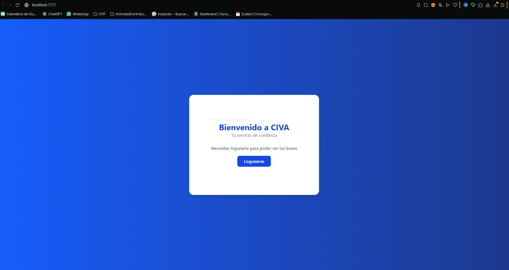

### Login

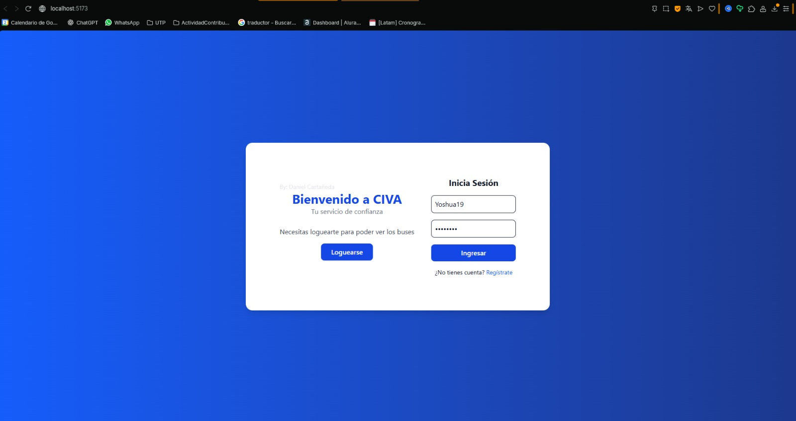
*El login permite acceder al sistema y generar un JWT para la sesión.*

### JWT generada

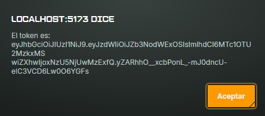
*Se muestra la alerta con la JWT obtenida tras iniciar sesión correctamente.*

### Registro de usuario

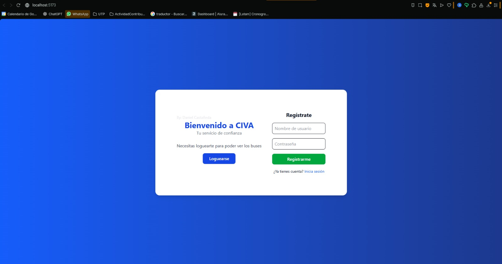
*Formulario de registro.*

---

## Funcionalidades del sistema

### Búsqueda por ID

#### Resultado encontrado

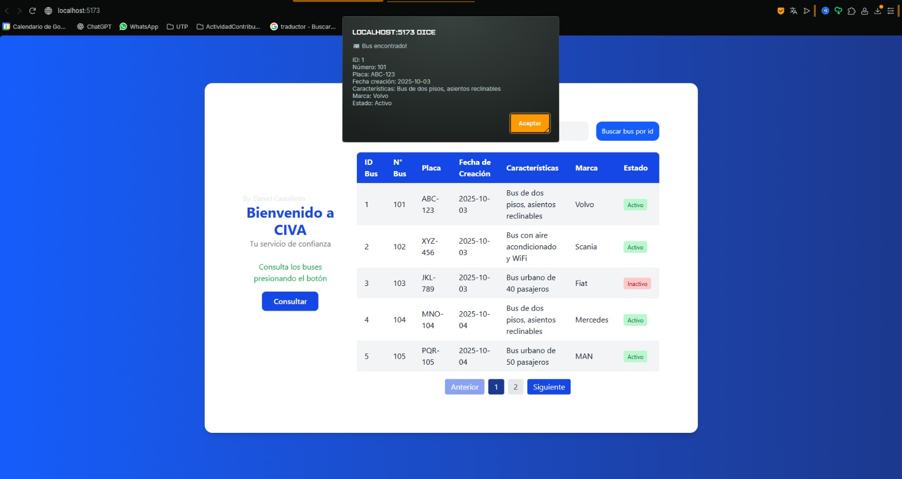

#### Resultado no encontrado

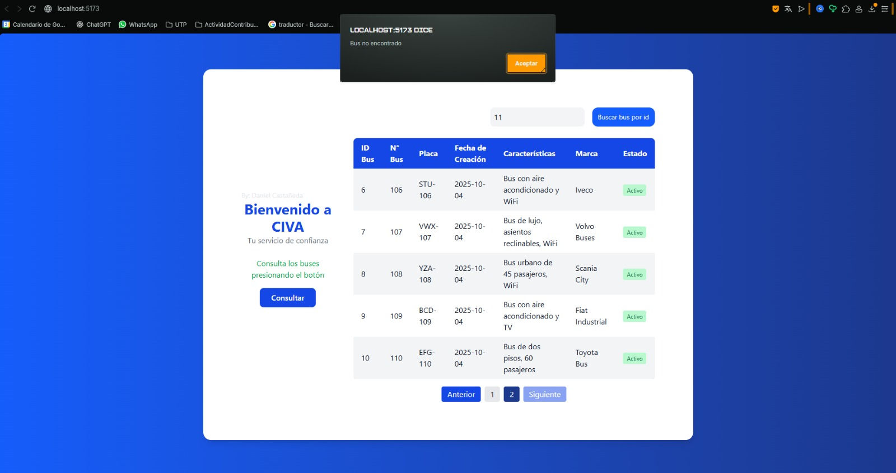

### Tablas y datos

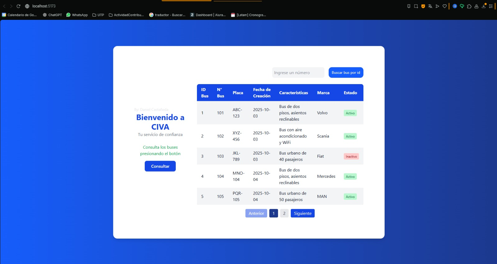

---

## Backend

### Código del REST Controller

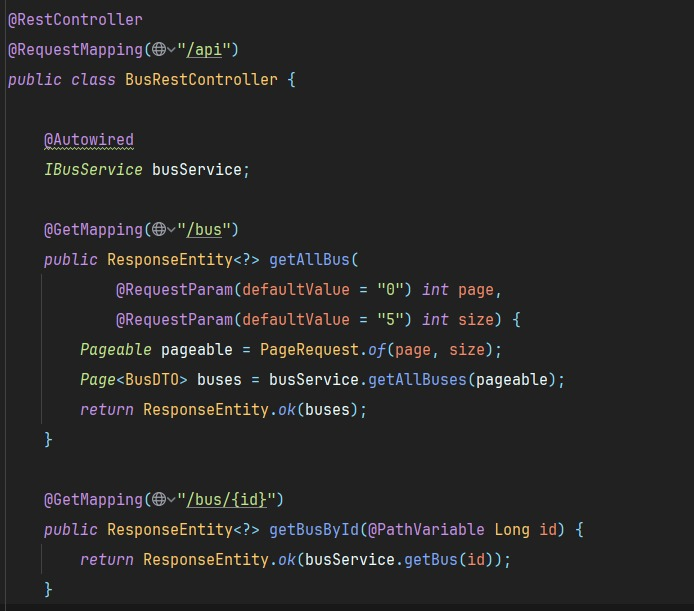

---

## Base de datos

### Tablas en PostgreSQL

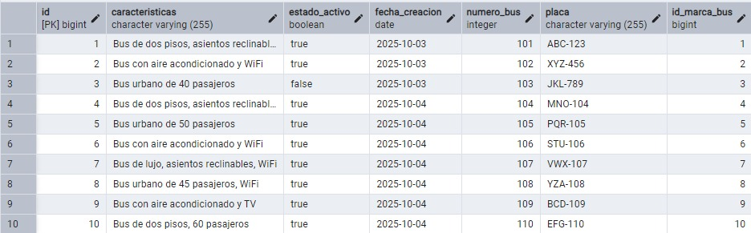
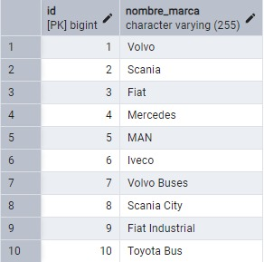
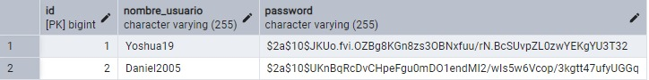

---

## Script de inserción de datos

```sql
-- Inserción de marcas de buses
INSERT INTO marca_bus (nombre_marca) VALUES ('Volvo');
INSERT INTO marca_bus (nombre_marca) VALUES ('Scania');
INSERT INTO marca_bus (nombre_marca) VALUES ('Fiat');
INSERT INTO marca_bus (nombre_marca) VALUES ('Mercedes');
INSERT INTO marca_bus (nombre_marca) VALUES ('MAN');
INSERT INTO marca_bus (nombre_marca) VALUES ('Iveco');
INSERT INTO marca_bus (nombre_marca) VALUES ('Volvo Buses');
INSERT INTO marca_bus (nombre_marca) VALUES ('Scania City');
INSERT INTO marca_bus (nombre_marca) VALUES ('Fiat Industrial');
INSERT INTO marca_bus (nombre_marca) VALUES ('Toyota Bus');

-- Inserción de buses
INSERT INTO bus (caracteristicas, estado_activo, fecha_creacion, numero_bus, placa, id_marca_bus)
VALUES
  ('Bus de dos pisos, asientos reclinables', true, now(), 101, 'ABC-123', 1), -- Volvo
  ('Bus con aire acondicionado y WiFi', true, now(), 102, 'XYZ-456', 2),      -- Scania
  ('Bus urbano de 40 pasajeros', false, now(), 103, 'JKL-789', 3),            -- Fiat
  ('Bus de dos pisos, asientos reclinables', true, now(), 104, 'MNO-104', 4), -- Mercedes
  ('Bus urbano de 50 pasajeros', true, now(), 105, 'PQR-105', 5),             -- MAN
  ('Bus con aire acondicionado y WiFi', true, now(), 106, 'STU-106', 6),       -- Iveco
  ('Bus de lujo, asientos reclinables, WiFi', true, now(), 107, 'VWX-107', 7),-- Volvo Buses
  ('Bus urbano de 45 pasajeros, WiFi', true, now(), 108, 'YZA-108', 8),       -- Scania City
  ('Bus con aire acondicionado y TV', true, now(), 109, 'BCD-109', 9),        -- Fiat Industrial
  ('Bus de dos pisos, 60 pasajeros', true, now(), 110, 'EFG-110', 10);        -- Toyota Bus
```

---

## Autor

* Daniel Castañeda

